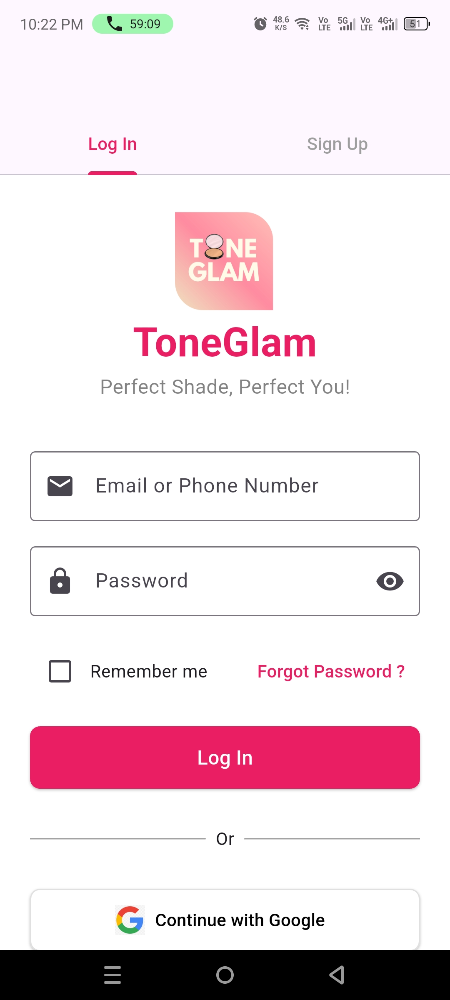
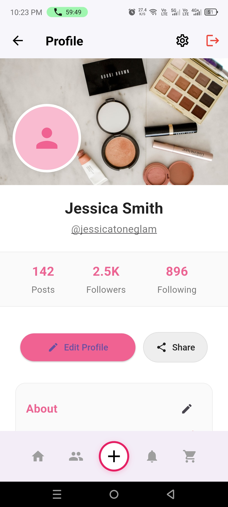
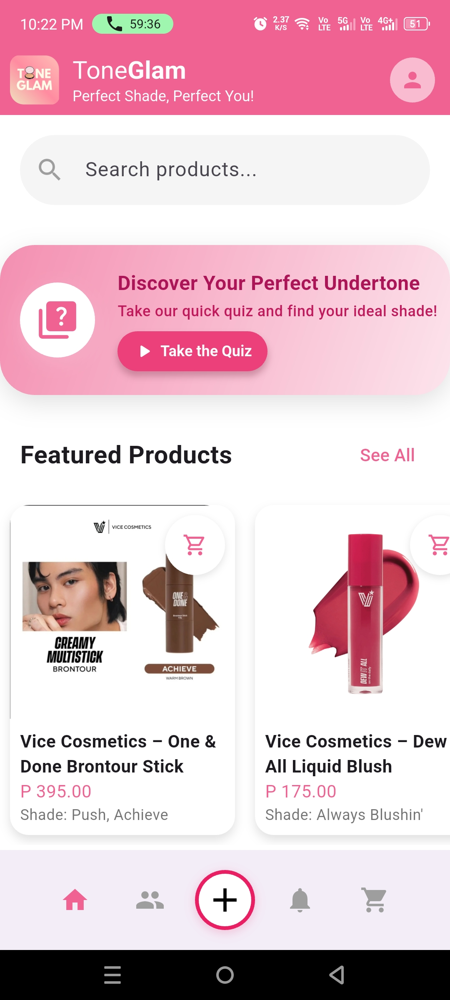
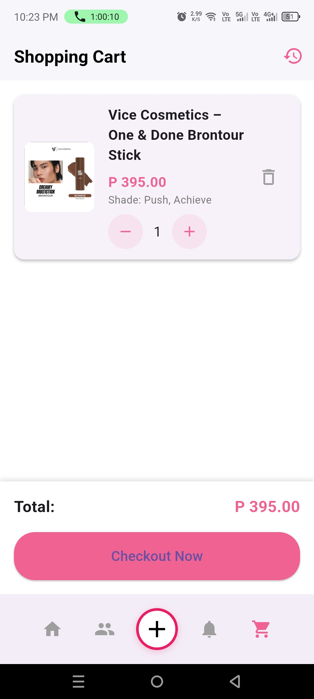

# ToneGlam

ToneGlam is a modern beauty and makeup application built with Flutter, designed to provide a seamless experience for beauty enthusiasts and makeup artists.

## Features

- **User Authentication**
  - Secure login system
  - Profile management
  - User settings and preferences

- **Profile Management**
  - Customizable profile pictures
  - Bio and username editing
  - Social media integration
  - Post management

- **Order Management**
  - Order history tracking
  - Order status updates
  - Order deletion capability

- **Notification System**
  - Real-time order notifications
  - System notifications
  - Notification preferences

- **Modern UI/UX**
  - Clean and intuitive interface
  - Responsive design
  - Material Design implementation

## Screenshots

<div align="center">
  <div>
    
    <p><b>Login Screen</b><br>Secure authentication with email and password</p>
  </div>
  <div>
    
    <p><b>Profile Screen</b><br>User profile with customizable settings and bio</p>
  </div>
  <div>
    
    <p><b>Homepage</b><br>Main dashboard with featured products and categories</p>
  </div>
  <div>
    
    <p><b>Checkout Screen</b><br>Secure payment and order processing</p>
  </div>
</div>

## Getting Started

### Prerequisites

- Flutter SDK (latest stable version)
- Dart SDK
- Android Studio / VS Code
- Git

### Installation

1. Clone the repository:
```bash
git clone https://github.com/yourusername/toneglam.git
```

2. Navigate to the project directory:
```bash
cd toneglam
```

3. Install dependencies:
```bash
flutter pub get
```

4. Run the app:
```bash
flutter run
```

## Project Structure

```
lib/
├── models/         # Data models
├── screens/        # UI screens
├── services/       # Business logic and services
├── widgets/        # Reusable widgets
└── main.dart       # Entry point
```

## Dependencies

- `provider`: State management
- `image_picker`: Image selection functionality
- `shared_preferences`: Local storage
- `flutter_local_notifications`: Notification handling

<<<<<<< HEAD
<<<<<<< HEAD
## Contributing

1. Fork the repository
2. Create your feature branch (`git checkout -b feature/AmazingFeature`)
3. Commit your changes (`git commit -m 'Add some AmazingFeature'`)
4. Push to the branch (`git push origin feature/AmazingFeature`)
5. Open a Pull Request

## License

This project is licensed under the MIT License - see the [LICENSE](LICENSE) file for details.
=======
>>>>>>> abc203b95a89e1ea19cd0a82d494caad3743c39b

## Contact

Facebook -https://www.facebook.com/josue.cuarezsalon


<<<<<<< HEAD
Project Link: [https://github.com/yourusername/toneglam](https://github.com/yourusername/toneglam)
=======
## Contact
[@Facebook](https://www.facebook.com/josue.cuarezsalon)
>>>>>>> f42ab689ac8179b8122232d52e74b23145779198
=======
>>>>>>> abc203b95a89e1ea19cd0a82d494caad3743c39b
